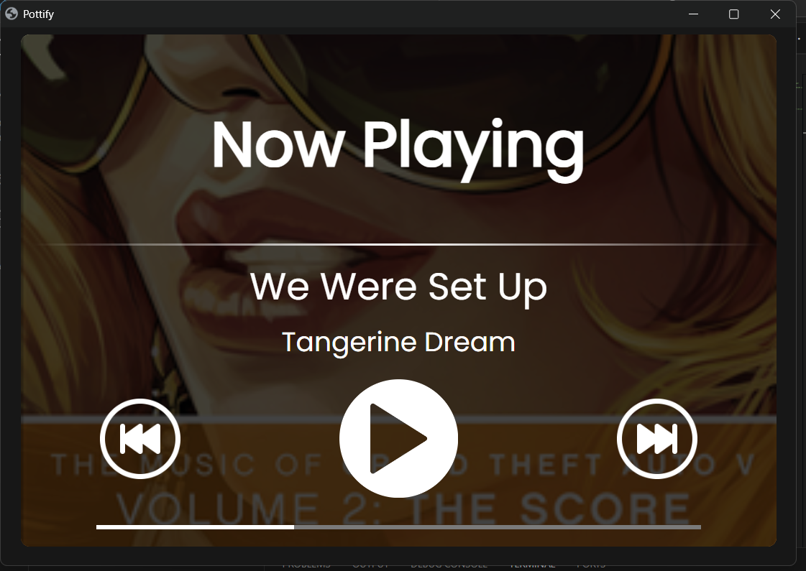

# Now Playing
 Simple python app to display the current playing song along a few options

## This needs Spicetify with Web Now Playing extension to run!!

### Features:
- Window scale responsive UI
- Easy to customise HTML/CSS based interface
- Simple UI
- Uses eel for the web app
- Uses pywnp for accessing now playing data
- Displays the song's cover art in the background

### How to run:
1. Clone the repo
2. Run the activate.bat in the venv folder
3. Run main.py

It is nowhere near polished but eh who cares.

## Screenshots:

